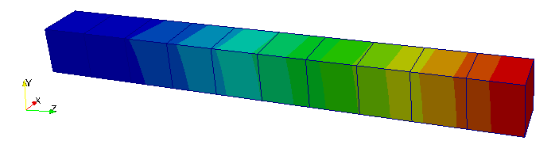
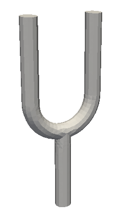
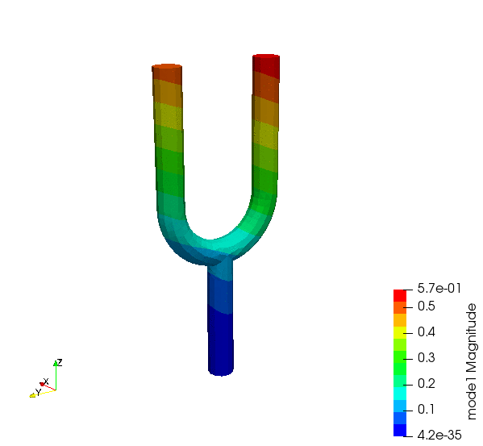
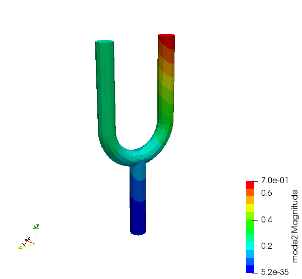

### new_abaqus
The finite element method (FEM) is way to solve engineering problem and mathematical models. Typical problem areas of interest include the traditional fields of structural analysis, heat transfer, fluid flow, mass transport, and electromagnetism... 
Abaqus (C) is a commercial software for solving a myriad of engineering problems using FEM. This small project attempts to emulate some of its features, in the field of structural analysis. The project is far from finished, but there's a few examples below that shows great promise in showing similar results to the software it tries to be.

One of the main features of new_abaqus is that it can read a mesh described in the specific Abaqus format. That format is explained [here](https://classes.engineering.wustl.edu/2009/spring/mase5513/abaqus/docs/v6.5/books/gss/default.htm?startat=ch02s03.html), for example. Typically one creates the mesh in a pre-processor and output the geometry to the Abaqus(C) format, one such open source software is [gmsh](https://gmsh.info/).


The program takes 1 argument, an input file containing the mesh and load case definition. On linux:
```
./new_abaqus example.inp
```
This will save an output file of the results called `example.vtk` and a logfile called `example.log`. The results can be viewed in the open source post processor ParaView.

The name is a joke from the character YinYang in the tv-show Silicon Valley, who has the idea for "new netflix".

### Examples
## Example #1, 2D 
This example is in 2D, and contains ~800 elements and ~900 nodes, with a mix of quad and trias. The geometry is fixed on the left hand side and a point force F is applied on the right, see figure below. The results are exactly the same between Abaqus (C) and new_abaqus.
Original geometry             |  Deformed geometry
:-------------------------:|:-------------------------:
  |  

| FE-solver      | Load node deflection (red arrow in figure above!) |
| ----------- | ----------- |
| ABAQUS (c)      | 0.0348       |
| new_abaqus   | 0.0346        |


## Example #2, simple bar in 3D 
Below is a bar discretized into 10 pieces of C3D20 (20-node hexa) elements. It's fixed in the far end. The table under contains the first ten eigenfrequencies for the system. The results could be said to agree very well.


| Eigenfrequency \[Hz\] | 1 | 2 | 3 | 4 | 5 | 6 | 7 | 8 |
|-------------|---|---|---|---|---|---|---|---|
| ABAQUS (c)  | 420.20 | 420.20  | 2531.3  | 2531.3  | 4009.6 | 6496.1 | 6704.7 | 6704.7 | 
| new_abaqus  | 420.48 | 427.86 | 2531.56 | 2532.4 | 4009.0 | 6494.25 | 6705.02| 6705.3 |

## Example #3, tuning fork in 3D 
A tuning fork made up of 4 thousand second order tetra element (C3D10). There results between Abaqus(C) and this software is relatively good. There is a larger discrepancy here between the two softwares than in example 2, but as the number of elements are larger that could be expected, but it's not entirely clear why..

Tuning fork geometry             |  First eigenmode |  Second eigenmode
-------------------------|-------------------------|-------------------------
  |   |  
| Eigenfrequency \[Hz\] | 1 | 2 | 3 | 4 | 5 | 6 | 7 | 8 |
|-------------|---|---|---|---|---|---|---|---|
| ABAQUS (c)  | 158.62 | 163.19 | 378.21 | 554.76 | 1120.28 | 1155.02 | 1186.46 | 1977.45 | 2501.20 | 3467.12
| new_abaqus  | 158.24 | 232.48 | 416.13 | 590.17 | 1120.96 | 1168.65 | 1192.04 | 1982.79 | 2504.98 | 3467.45


### Element types available
CPS3, CPS4, C3D10, C3D8, C3D20 


### How to install
TBD... For now there only exists a vscode build file, see ```.vscode/tasks.json```.

### Dependencies
C++11
[Eigen](http://eigen.tuxfamily.org/)
[Spectra](https://spectralib.org/)


### To-do & Features implemented
- [ ] Guide how to install
- [ ] makefile
- [x] Implement logic and structure for reading abaqus input files
  - [ ] Disregard unused nodes
- [x] Set up classes and functions for nodes, elements, properties and materials
- [ ] Implement logic for different elements
  - [x] 2D first order tria (S2)
  - [x] 2D first order quadrilateral (CPS4) 
  - [x] 3D second order tetra (C3D10)
  - [X] 3D first order hexahedron (C3D8)
  - [X] 3D second order hexahedron (C3D20)
- [x] Assemble mass matrix  
- [x] Assemble stiffness matrix
  - [x] Modify stiffness matrix and load vector to account for boundary conditions
- [x] Add support for more keywords
  - [x] *BOUNDARY
  - [x] *CLOAD
  - [X] *MATERIAL
  - [X] *SECTION
  - [X] *NSET
  - [ ] *STEP
  - [X] *STATIC 
  - [X] *EIGENFREQUENCY
  - [ ] *OUTPUT
- [x] Solve Ku=f for linear problems
- [ ] Support for simple contact mechanics
- [ ] Calculate scalar values on elements
  - [ ] Stresses and strains
  - [ ] von Mises stress
- [X] Solve eigen value problem
  - [X] Calculate mass matrix in element construction
- [ ] Add sanity checks to log-file
  - [x] Print total model weight
  - [ ] Print total model volume
  - [ ] Print center of gravity

- [ ] Export results to VTK format to view results in ParaView
  - [x] Nodal displacement
  - [x] Eigenmodes 
  - [ ] Stresses and strains  
- [x] Re-direct output to a log file for debugging  
  - [x] Print timing for each step in logfile as basic profiling
- [ ] Some basic error handling
  - [X] Print warning and exit program on small or negative Jacobian determinant  
  - [ ] Print error in log file and exit when a specified material, node set, section or whatever does not exist
- [ ] Automate test cases for comparison solution against abaqus or hand calculations


