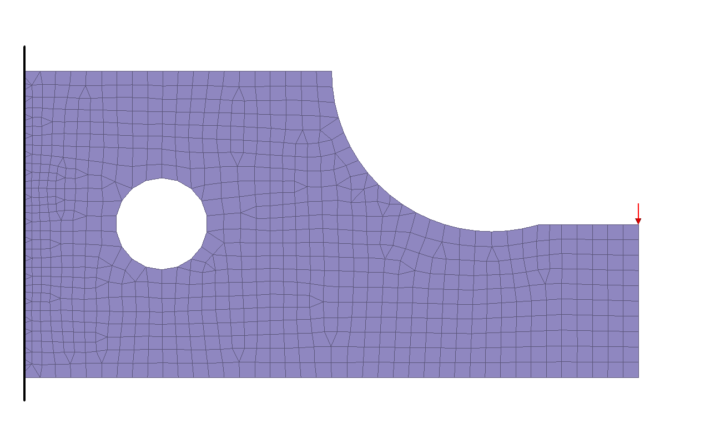
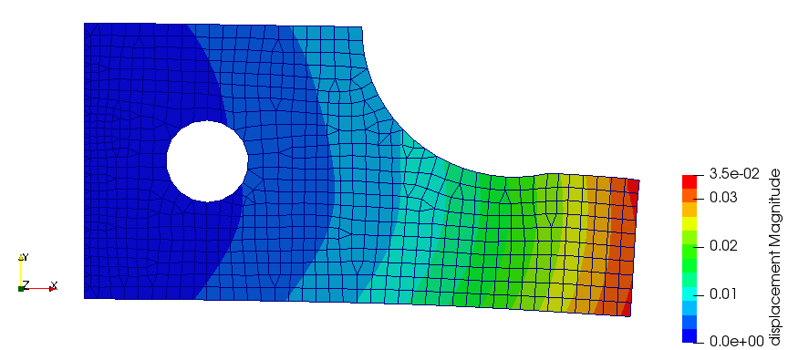
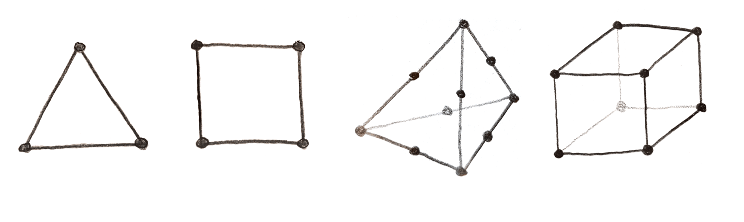

### new_abaqus
new_abaqus is a hobby project for creating an FE-solver reading an FE-mesh following the syntax of the commercial software abaqus. 

The name is a joke from the character YinYang in Silicon Valley, who has the idea for "new netflix".

### Example
The program takes 1 argument, an input file containing the mesh and load case definition. On linux:
```
./new_abaqus example_runfiles/ex3.inp
```
This will save an output file of the results called `ex3.vtk` and a logfile called `ex3.log`. The results can be viewed in the open source post processor ParaView.

This example is in 2D, and contains ~800 elements and ~900 nodes, with a mix of quad and trias.  Result comparison:





| FE-solver      | Load node deflection (red arrow in figure above!) |
| ----------- | ----------- |
| abaqus (c)      | 0.0348       |
| new_abaqus   | 0.0346        |


### Element types available
CPS3, CPS4, C3D10, C3D8




### To-do & Features implemented
- [x] Implement logic and structure for reading abaqus input files
  - [ ] Disregard unused nodes
- [x] Set up classes and functions for nodes, elements, properties and materials
- [ ] Implement logic for different elements
  - [x] 2D first order tria (S2)
  - [x] 2D first order quadrilateral (CPS4) 
  - [ ] 3D second order tetra (C3D10)
  - [X] 3D first order hexahedron (C3D8)
  - [X] 3D second order hexahedron (C3D20)
- [x] Assemble mass matrix  
- [x] Assemble stiffness matrix
  - [x] Modify stiffness matrix and load vector to account for boundary conditions
- [x] Add support for more keywords
  - [x] *BOUNDARY
  - [x] *CLOAD
  - [X] *MATERIAL
  - [X] *SECTION
  - [ ] *STEP
  - [X] *STATIC 
  - [X] *EIGENFREQUENCY
  - [ ] *OUTPUT
- [x] Solve Ka=f for linear problems
- [ ] Support for simple contact mechanics
- [ ] Calculate scalar values on elements
  - [ ] Stresses and strains
  - [ ] von Mises stress
- [X] Solve eigen value problem
  - [X] Calculate mass matrix in element construction (note: not available for all..)
- [ ] Add sanity checks to log-file
  - [x] Print total model weight
  - [ ] Print total model volume
  - [ ] Print center of gravity

- [ ] Export results to VTK format to view results in ParaView
  - [x] Nodal displacement
  - [x] Eigenmodes 
  - [ ] Stresses and strains  
- [x] Re-direct output to a log file for debugging  
  - [x] Print timing for each step in logfile as basic profiling
- [ ] Some basic error handling
  - [X] Print warning and exit program on small or negative Jacobian determinant  
- [ ] makefile
- [ ] Automate test cases for comparison solution against abaqus or hand calculations


