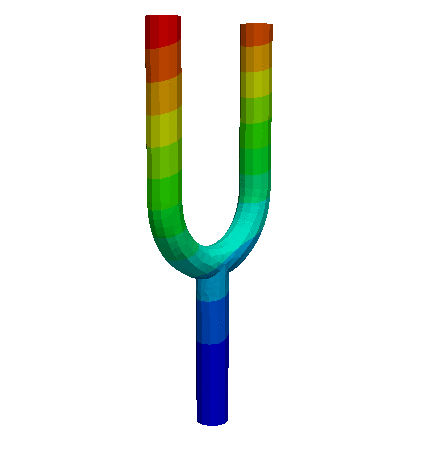

### new_abaqus
The finite element method (FEM) is way to solve engineering problem and mathematical models. Typical problem areas of interest include the traditional fields of structural analysis, heat transfer, fluid flow, mass transport, and electromagnetism.

Abaqus (C) is a commercial software for solving a myriad of engineering problems using FEM. This small project attempts to emulate some of its features, in the field of structural analysis. The project is far from finished, but there's a few examples below that shows great promise in showing similar results to the software it tries to be.


One of the main features of new_abaqus is that it can read a mesh described in the specific Abaqus format. That format is explained [here](https://classes.engineering.wustl.edu/2009/spring/mase5513/abaqus/docs/v6.5/books/gss/default.htm?startat=ch02s03.html), for example. Typically one creates the mesh in a pre-processor and output the geometry to the Abaqus(C) format, one such open source software is [gmsh](https://gmsh.info/).


The program takes 1 argument: an input file containing the mesh and load case definition.
```bash
./new_abaqus example.inp
```
This will save an output file of the results called `example.vtk` and a logfile called `example.log`. The results can be viewed in the open source post processor [ParaView](https://www.paraview.org/).

The name is a joke from the character YinYang in the tv-show Silicon Valley, who has the idea for "new netflix".

## Example #1, 2D geometry with a point load
This example is in 2D, and contains ~800 elements and ~900 nodes, with a mix of quad and trias. The geometry is fixed on the left hand side and a point force F is applied on the right, see figure below. The results are exactly the same between Abaqus (C) and new_abaqus.
| Original geometry             | Deformed geometry | 
:-------------------------:|:-------------------------:
  |  

| FE-solver      | Load node deflection (red arrow in figure above!) |
| ----------- | ----------- |
| ABAQUS (c)      | 0.0348       |
| new_abaqus   | 0.0346        |

To run this example:
```bash
./new_abaqus example_runfiles/example1_2D.inp
```

## Example #2, 3D tuning fork 
A tuning fork made up of 4 thousand second order tetra element (C3D10). This mesh has 23 thousand degrees of freedom and took ~~close to an hour~~ 24 seconds to solve on my laptop. However, it takes only 7 seconds to solve on the same computer using [Calculix](http://www.calculix.de/) which is another FEM solver that also follows the Abaqus(C) input file format.

The comparison of results between Abaqus(C) and new_abaqus is good in this example. For the 8 first modes the average difference is 17Hz and the maximum difference is 70Hz which I chalk up to the eigenvalue solver.

Tuning fork geometry | 1st eigenmode | 4th eigenmode
-------------------------|-------------------------|-------------------------
  |   |  


| Eigenfrequency \[Hz\] | 1 | 2 | 3 | 4 | 5 | 6 | 7 | 8 |
|-------------|---|---|---|---|---|---|---|---|
| Abaqus (c)  | 158.62 | 163.19 | 378.21 | 554.76 | 1120.28 | 1155.02 | 1186.46 | 1977.45 | 2501.20 | 3467.12
| new_abaqus  | 158.24 | 232.48 | 416.13 | 590.17 | 1120.96 | 1168.65 | 1192.04 | 1982.79 | 2504.98 | 3467.45


To run this example:
```bash
./new_abaqus example_runfiles/example3_tuning_fork.inp
```

## Supported Abaqus keywords
The below keywords and and its following options are supported. The datalines to each keyword follows the Abaqus (C) syntax defintion.

*NODE

*ELEMENT, type, elset

*MATERIAL, name

*DENSITY

*ELASTIC

*SOLID SECTION, name, material

*BOUNDARY, type=displacement

*NSET, nset

*FREQUENCY

*STATIC

## Element types available
CPS3, CPS4, C3D10, C3D8, C3D20 


# How to build
Dependencies:

C++14

CMake

[Eigen](http://eigen.tuxfamily.org/)

[Spectra](https://spectralib.org/)

Eigen is a library used for linear algebra, and Spectra is an add-on to that library that is used to solve the eigenvalue problem. Both libraries are header only and included in the repo.

## Linux build
```bash
git clone https://github.com/sparlund/new_abaqus
cd new_abaqus
cmake --build . --target new_abaqus
```
To build and run unit test:
```bash
cmake --build . --target UT
./UT
```
To see unit test code coverage:
To build and run unit test:
```bash
cmake --build . --target UT_coverage
```
## Windows build
I don't have access to a Windows PC so I don't know, use the CMakefile somehow...

# To-do & features implemented
- [x] ~~makefile~~ CMake build system  
-   [ ] Automate test cases for comparison solution against abaqus or hand calculations
    - [X] Set up gtest
    - [X] Set up unit test code coverage
    - [X] Verify results for a few example analysis
- [X] Set up clang-tidy for static code analysis
- [x] Implement logic and structure for reading abaqus input files
  - [ ] Disregard unused nodes
  - [X] Allow for commentented lines to start with whitespace
  - [ ] Exit if trying to create element with a N/A node
  - [X] Allow entities to be defined in any order
- [x] Create classes and relations for nodes, elements, properties and materials
- [X] Implement logic for different elements
  - [x] 2D first order tria (S2)
  - [x] 2D first order quadrilateral (CPS4) 
  - [x] 3D second order tetra (C3D10)
  - [X] 3D first order hexahedron (C3D8)
  - [X] 3D second order hexahedron (C3D20)
- [x] Assemble mass matrix  
- [x] Assemble stiffness matrix
  - [x] Modify stiffness matrix and load vector to account for boundary conditions
- [x] Add support for more keywords
  - [x] *BOUNDARY
  - [x] *CLOAD
  - [X] *MATERIAL
  - [X] *SECTION
  - [X] *NSET
  - [X] *STATIC 
  - [X] *EIGENFREQUENCY
  - [X] *INCLUDE
  - [ ] *CONTACT PAIR
  - [ ] *STEP
  - [ ] *OUTPUT
- [x] Solve Ku=f for linear problems
- [ ] Contact mechanics
  - [x] Create segments from master node set
  - [x] Gap function that checks distance from slave node to master set for arbitrary geometry
  - [ ] Print information for each load step similar to how ABAQUS does
  - [ ] Find contact force at contact interface and correct penetration
- [ ] Calculate scalar values on elements
  - [X]  Strains
  - [ ] Stresses
  - [ ] von Mises stress
- [X] Solve eigen value problem
  - [X] Calculate mass matrix in element construction
- [ ] Add sanity checks to log-file
  - [x] Print total model weight
  - [ ] Print total model volume
  - [ ] Print center of gravity
- [ ] Export results to VTK format to view results in ParaView
  - [x] Nodal displacement
  - [x] Eigenmodes 
  - [ ] Stresses and strains
- [x] Re-direct output to a log file for debugging  
  - [x] Print timing for each step in logfile as basic profiling
- [ ] Some basic error handling
  - [X] Print warning and exit program on small or negative Jacobian determinant  
  - [ ] Print error in log file and exit when a specified material, node set, section or whatever does not exist

# Program size

The binary new_abaqus is ~0.4mB on my system.

```
--------------------------------------------------
Language           Number of files   Lines of code
--------------------------------------------------
C++                             18            2054
C++ Header                      16             526
Python                           1               9
CMake                            1              47
--------------------------------------------------
SUM:                            37            2636
--------------------------------------------------
```